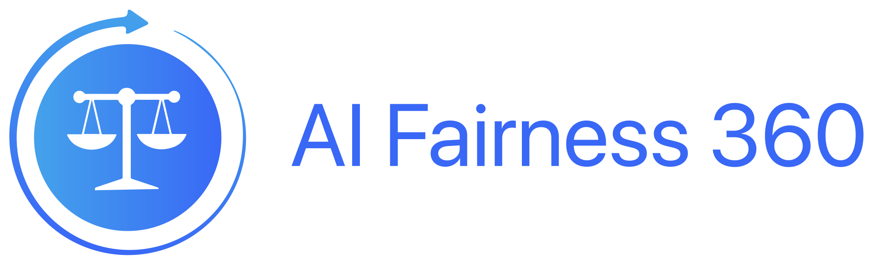
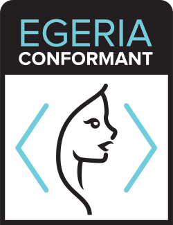

<section>

<h2>LF AI & Data Foundation Logos</h2>
    

Use of any trademark or logo is subject to the trademark policy available at <a href="https://www.linuxfoundation.org/trademark-usage">https://www.linuxfoundation.org/trademark-usage</a> with the key excepts available at <a href="LICENSE.md">LICENSE.md</a>. Questions? Please email <a href="mailto:info@lfaidata.foundation">info@lfaidata.foundation</a>.

We prepare artwork in 3 formats (PNG/SVG/AI), 3 layouts -- horizontal (also known as landscape format), stacked (which is closer to square), and icon (which does not include the name and is square), and 3 versions (color/black/white). So, that's at least 27 versions of most logos.

<h3>Graduated Projects</h3>

<a href="projects/acumos">

View Logos »

</a>

<a href="projects/angel">

View Logos »

</a>

<a href="projects/egeria">

View Logos »

</a>

<a href="projects/onnx">

View Logos »

</a>

<a href="projects/pyro">

View Logos »

</a>

<h3>Incubation Projects</h3>

<a href="projects/adlik">

View Logos »

</a>

<a href="projects/adversarial-robustness-toolbox">

View Logos »

</a>

<a href="projects/ai-explainability-360">

View Logos »

</a>

<a href="projects/ai-fairness-360">

View Logos »

</a>

<a href="projects/amundsen">

View Logos »

</a>

<a href="projects/datapractices">

View Logos »

</a>

<a href="projects/delta">

View Logos »

</a>

<a href="projects/edl">

View Logos »

</a>

<a href="projects/feast">

View Logos »

</a>

<a href="projects/flyte">

View Logos »

</a>

<a href="projects/forestflow">

View Logos »

</a>

<a href="projects/horovod">

View Logos »

</a>

<a href="projects/janusgraph">

View Logos »

</a>

<a href="projects/ludwig">

View Logos »

</a>

<a href="projects/marquez">

View Logos »

</a>

<a href="projects/milvus">

View Logos »

</a>

<a href="projects/nnstreamer">

View Logos »

</a>

<a href="projects/opends4all">

View Logos »

</a>

<a href="projects/soajs">

View Logos »

</a>

<a href="projects/sparklyr">

View Logos »

</a>

<h3>Other Logos</h3>

<a href="lfaidata-assets/lfaidata">

View Logos »

</a>

<a href="lfaidata-assets/lfaidata-landscape">

View Logos »

</a>

<a href="lfaidata-assets/lfaidata-membership-badge">

View Logos »

</a>

<a href="lfaidata-assets/lfaidata-project-badge">

View Logos »

</a>

<a href="lfaidata-assets/lf-member">

View Logos »

</a>

<a href="lfaidata-assets/egeria-conformance">

View Logos »

</a>

</section>
