## Other Logos

*Note: GitHub Flavored Markdown used in the Readme doesn't support background colors. The white logos below are displayed on the light grey of tables.*

### Acumos

<table class="logos-table">
	<thead>
		<tr>
			<th></th>
			<th colspan="3">PNG</th>
			<th colspan="3">SVG</th>
		</tr>
		<tr>
			<th></th>
			<th>horizontal</th>
			<th>stacked</th>
			<th>icon</th>
			<th>horizontal</th>
			<th>stacked</th>
			<th>icon</th>
		</tr>
	</thead>	
    <tbody>
		<tr>
			<th>color</th>
			<td></td>
			<td></td>
			<td></td>
			<td></td>
			<td></td>
			<td></td>
		</tr>
		<tr>
			<th>white</th>
			<td></td>
			<td></td>
			<td></td>
			<td></td>
			<td></td>
			<td></td>
		</tr>
		<tr>
			<th>black</th>
			<td></td>
			<td></td>
			<td></td>
			<td></td>
			<td></td>
			<td></td>
		</tr>
	</tbody>	
</table>

### Adlik

<table class="logos-table">
	<thead>
		<tr>
			<th></th>
			<th colspan="2">PNG</th>
			<th colspan="2">SVG</th>
		</tr>
		<tr>
			<th></th>
			<th>horizontal</th>
			<th>icon</th>
			<th>horizontal</th>
			<th>icon</th>
		</tr>
	</thead>	
    <tbody>
		<tr>
			<th>color</th>
			<td></td>
			<td><a href="../projects/adlik/icon/color/adlik-icon-color.png" download>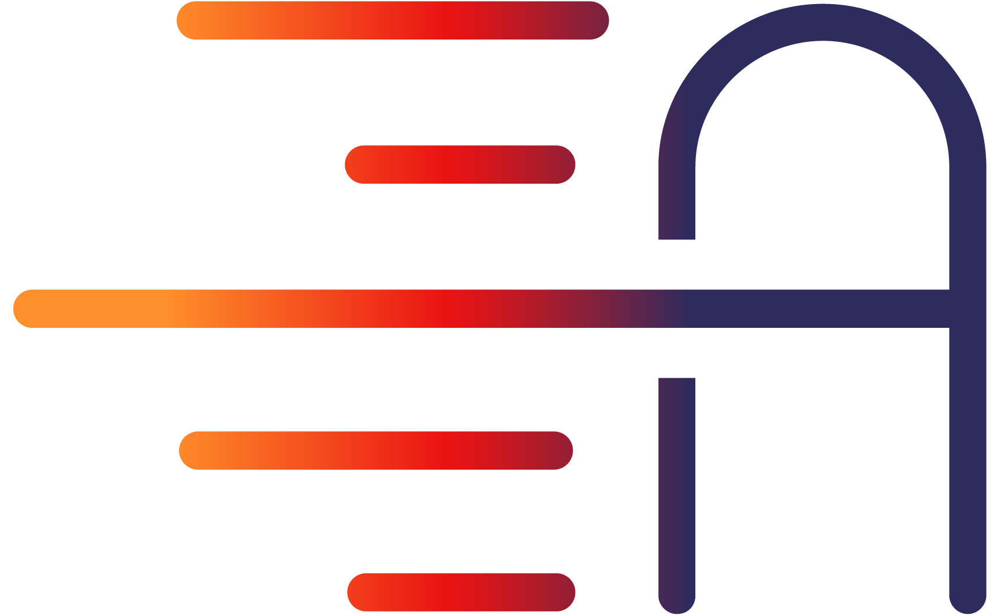</a></td>
			<td></td>
			<td></td>
		</tr>
		<tr>
			<th>white</th>
			<td></td>
			<td></td>
			<td></td>
			<td><a href="../projects/adlik/icon/white/adlik-icon-white.svg" download>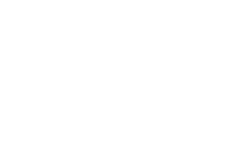</a></td>
		</tr>
		<tr>
			<th>black</th>
			<td></td>
			<td></td>
			<td></td>
			<td></td>
		</tr>
	</tbody>	
</table>

### Adversarial Robustness Toolbox

<table class="logos-table">
	<thead>
		<tr>
			<th></th>
			<th colspan="3">PNG</th>
			<th colspan="3">SVG</th>
		</tr>
		<tr>
			<th></th>
			<th>horizontal</th>
			<th>stacked</th>
			<th>icon</th>
			<th>horizontal</th>
			<th>stacked</th>
			<th>icon</th>
		</tr>
	</thead>	
    <tbody>
		<tr>
			<th>color</th>
			<td></td>
			<td><a href="../projects/adversarial-robustness-toolbox/stacked/color/adversarial-robustness-toolbox-stacked-color.png" download>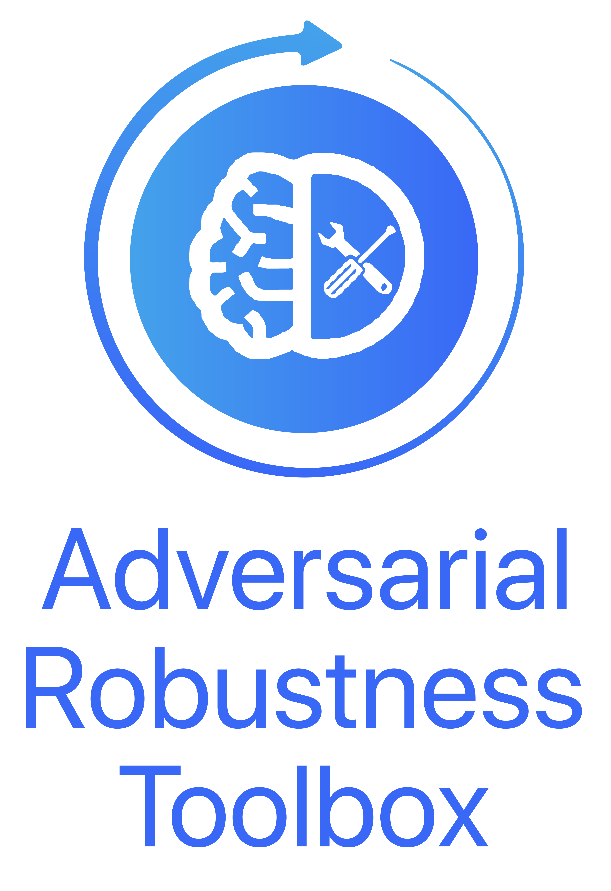</a></td>
			<td><a href="../projects/adversarial-robustness-toolbox/icon/color/adversarial-robustness-toolbox-icon-color.png" download>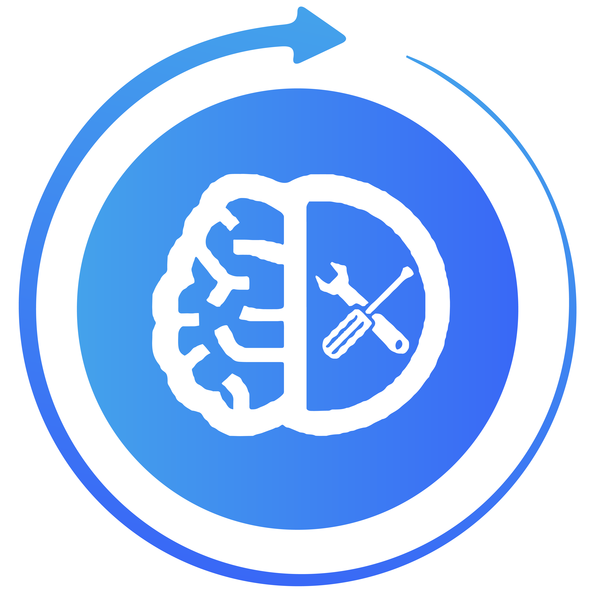</a></td>
			<td></td>
			<td></td>
			<td></td>
		</tr>
		<tr>
			<th>white</th>
			<td></td>
			<td></td>
			<td></td>
			<td></td>
			<td><a href="../projects/adversarial-robustness-toolbox/stacked/white/adversarial-robustness-toolbox-stacked-white.svg" download>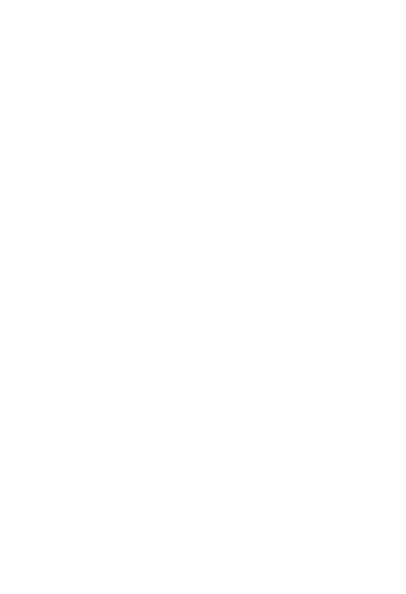</a></td>
			<td><a href="../projects/adversarial-robustness-toolbox/icon/white/adversarial-robustness-toolbox-icon-white.svg" download>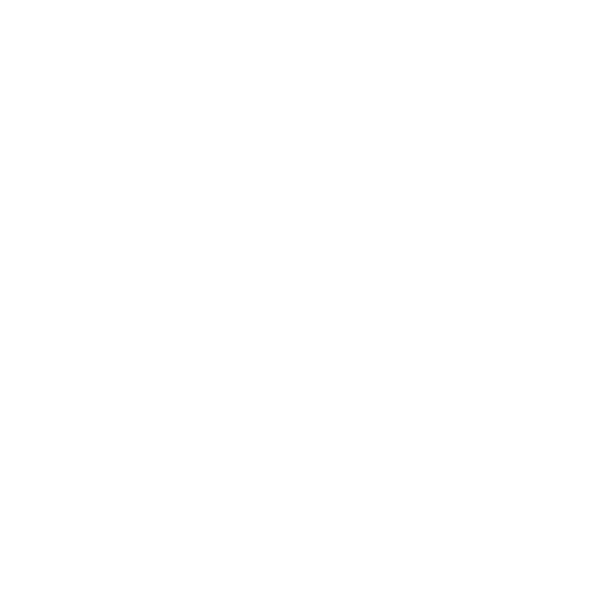</a></td>
		</tr>
		<tr>
			<th>black</th>
			<td><a href="../projects/adversarial-robustness-toolbox/horizontal/black/adversarial-robustness-toolbox-horizontal-black.png" download>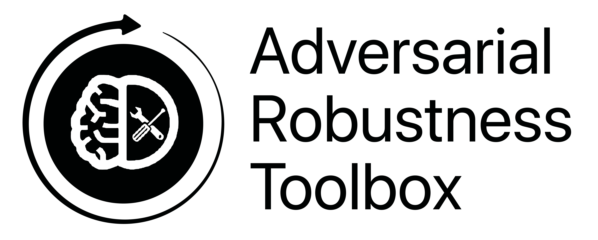</a></td>
			<td><a href="../projects/adversarial-robustness-toolbox/stacked/black/adversarial-robustness-toolbox-stacked-black.png" download>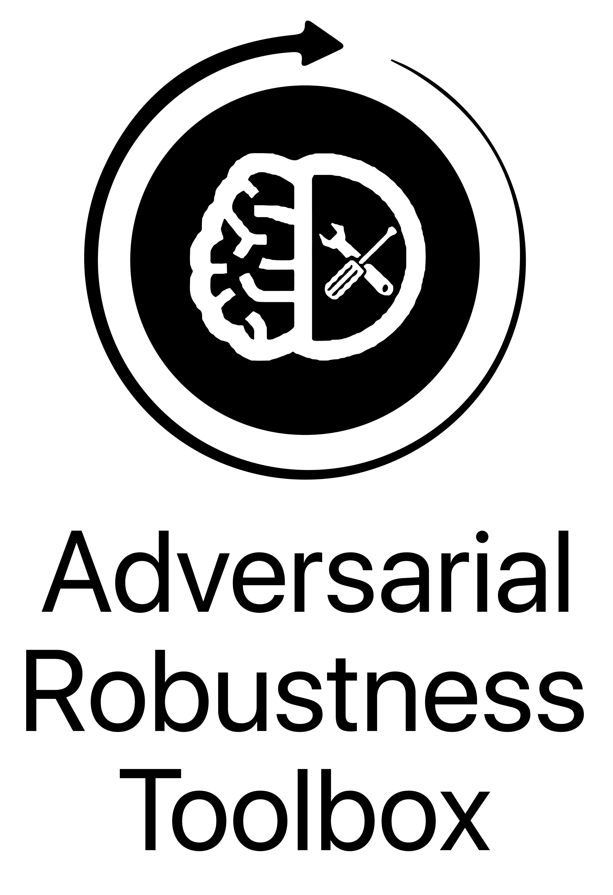</a></td>
			<td></td>
			<td></td>
			<td></td>
			<td></td>
		</tr>
	</tbody>	
</table>

### AI Explainability 360

<table class="logos-table">
	<thead>
		<tr>
			<th></th>
			<th colspan="3">PNG</th>
			<th colspan="3">SVG</th>
		</tr>
		<tr>
			<th></th>
			<th>horizontal</th>
			<th>stacked</th>
			<th>icon</th>
			<th>horizontal</th>
			<th>stacked</th>
			<th>icon</th>
		</tr>
	</thead>	
    <tbody>
		<tr>
			<th>color</th>
			<td></td>
			<td></td>
			<td></td>
			<td></td>
			<td></td>
			<td></td>
		</tr>
		<tr>
			<th>white</th>
			<td></td>
			<td></td>
			<td></td>
			<td></td>
			<td></td>
			<td></td>
		</tr>
		<tr>
			<th>black</th>
			<td></td>
			<td></td>
			<td></td>
			<td></td>
			<td></td>
			<td></td>
		</tr>
	</tbody>	
</table>

### AI Fairness 360

<table class="logos-table">
	<thead>
		<tr>
			<th></th>
			<th colspan="3">PNG</th>
			<th colspan="3">SVG</th>
		</tr>
		<tr>
			<th></th>
			<th>horizontal</th>
			<th>stacked</th>
			<th>icon</th>
			<th>horizontal</th>
			<th>stacked</th>
			<th>icon</th>
		</tr>
	</thead>	
    <tbody>
		<tr>
			<th>color</th>
			<td></td>
			<td><a href="../projects/ai-fairness-360/stacked/color/ai-fairness-360-stacked-color.png" download>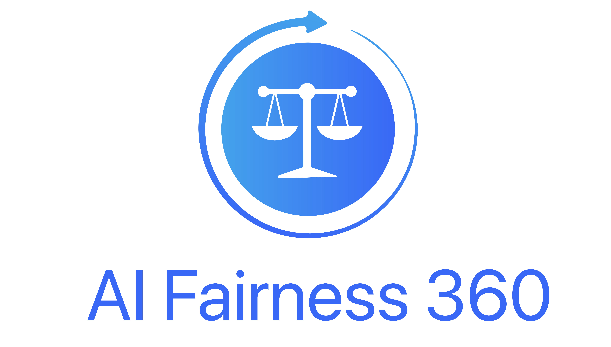</a></td>
			<td><a href="../projects/ai-fairness-360/icon/color/ai-fairness-360-icon-color.png" download>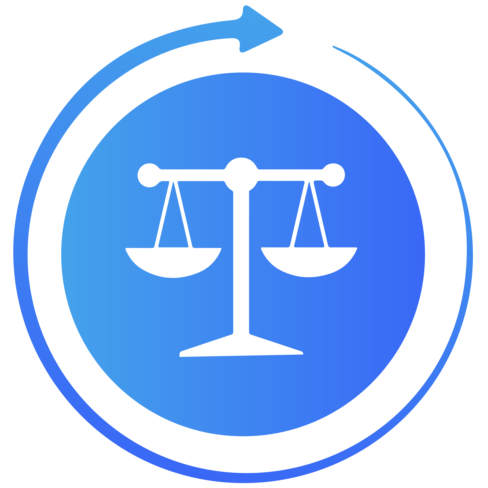</a></td>
			<td></td>
			<td></td>
			<td></td>
		</tr>
		<tr>
			<th>white</th>
			<td></td>
			<td></td>
			<td></td>
			<td><a href="../projects/ai-fairness-360/horizontal/white/ai-fairness-360-horizontal-white.svg" download>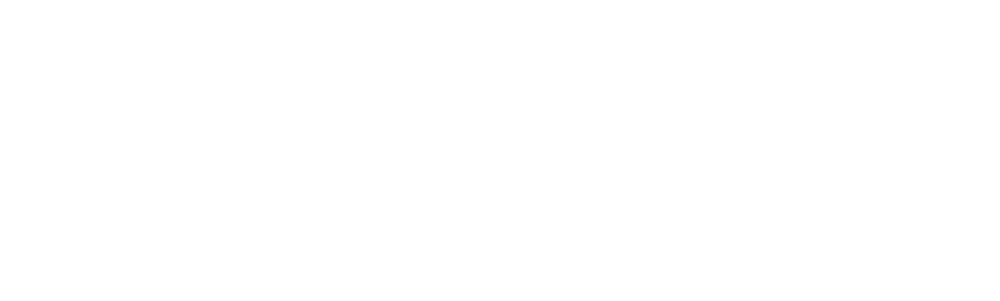</a></td>
			<td></td>
			<td><a href="../projects/ai-fairness-360/icon/white/ai-fairness-360-icon-white.svg" download>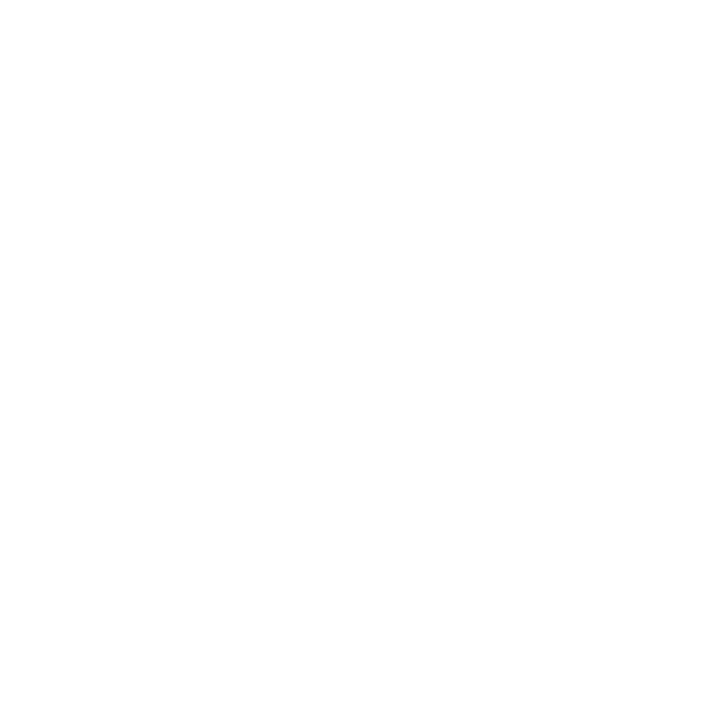</a></td>
		</tr>
		<tr>
			<th>black</th>
			<td></td>
			<td><a href="../projects/ai-fairness-360/stacked/black/ai-fairness-360-stacked-black.png" download>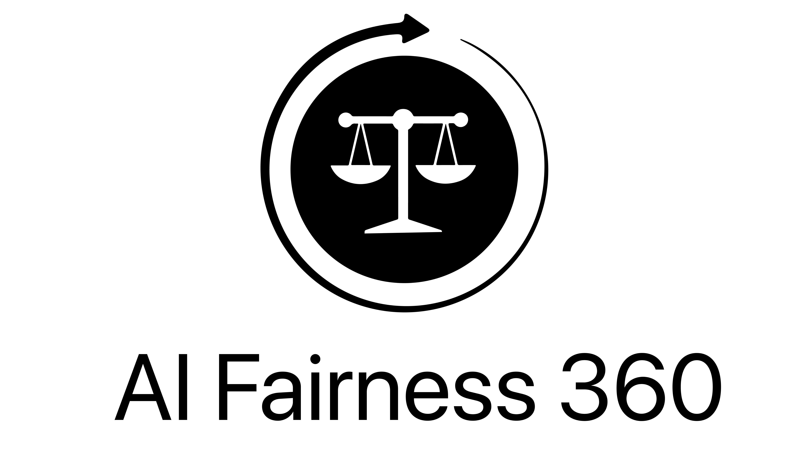</a></td>
			<td></td>
			<td></td>
			<td></td>
			<td></td>
		</tr>
	</tbody>	
</table>

### Amundsen

<table class="logos-table">
	<thead>
		<tr>
			<th></th>
			<th colspan="3">PNG</th>
			<th colspan="3">SVG</th>
		</tr>
		<tr>
			<th></th>
			<th>horizontal</th>
			<th>stacked</th>
			<th>icon</th>
			<th>horizontal</th>
			<th>stacked</th>
			<th>icon</th>
		</tr>
	</thead>	
    <tbody>
		<tr>
			<th>color</th>
			<td></td>
			<td></td>
			<td><a href="../projects/amundsen/icon/color/amundsen-icon-color.png" download>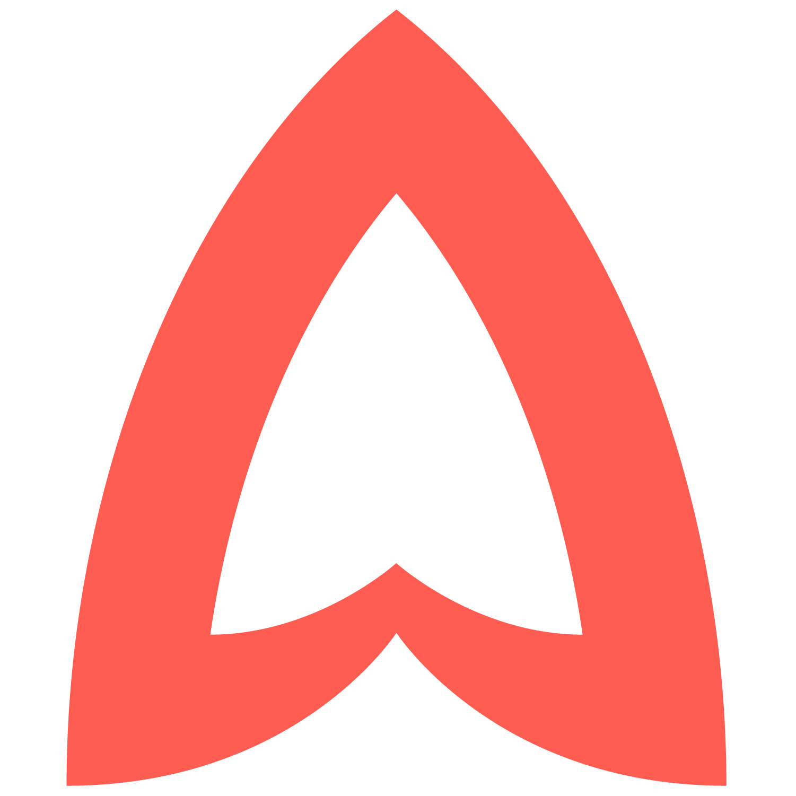</a></td>
			<td></td>
			<td></td>
			<td></td>
		</tr>
		<tr>
			<th>white</th>
			<td></td>
			<td></td>
			<td></td>
			<td></td>
			<td></td>
			<td></td>
		</tr>
		<tr>
			<th>black</th>
			<td><a href="../projects/amundsen/horizontal/black/amundsen-horizontal-black.png" download>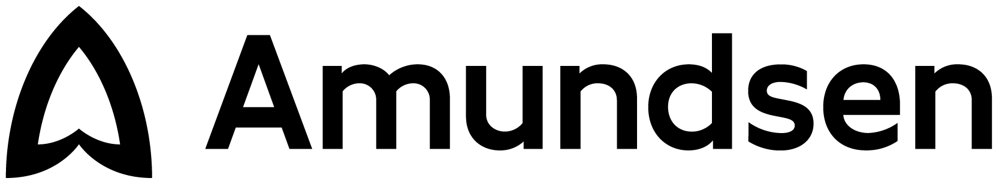</a></td>
			<td></td>
			<td><a href="../projects/amundsen/icon/black/amundsen-icon-black.png" download>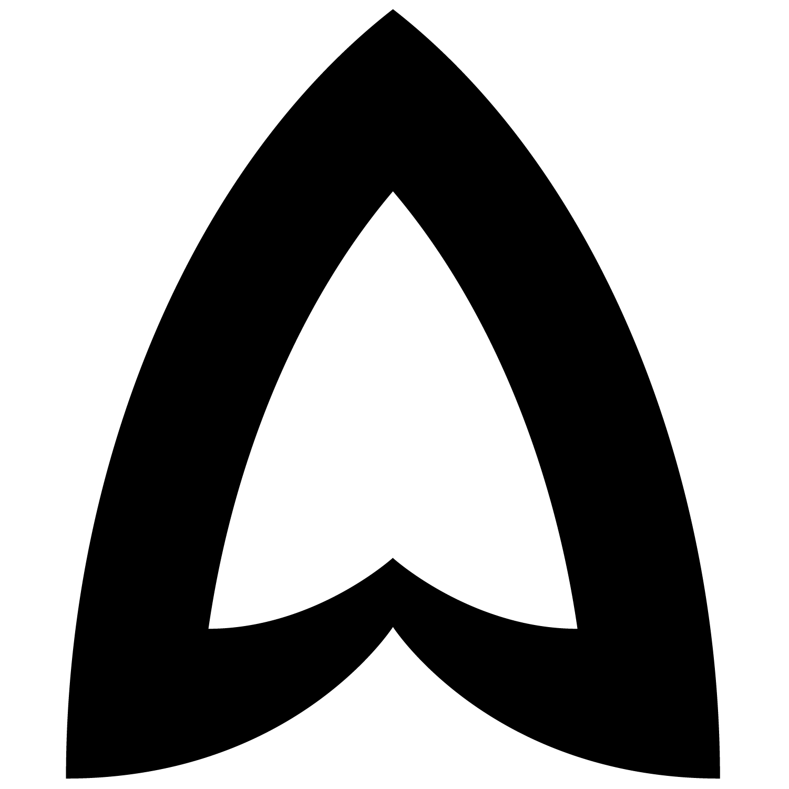</a></td>
			<td></td>
			<td></td>
			<td></td>
		</tr>
	</tbody>	
</table>

### Angel ML

<table class="logos-table">
	<thead>
		<tr>
			<th></th>
			<th colspan="3">PNG</th>
			<th colspan="3">SVG</th>
		</tr>
		<tr>
			<th></th>
			<th>horizontal</th>
			<th>stacked</th>
			<th>icon</th>
			<th>horizontal</th>
			<th>stacked</th>
			<th>icon</th>
		</tr>
	</thead>	
    <tbody>
		<tr>
			<th>color</th>
			<td><a href="../projects/angel/horizontal/color/angel-horizontal-color.png" download>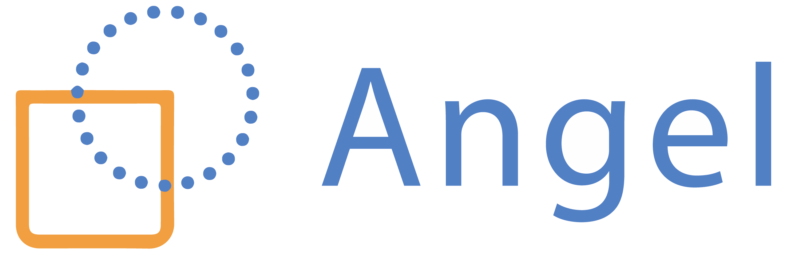</a></td>
			<td></td>
			<td><a href="../projects/angel/icon/color/angel-icon-color.png" download>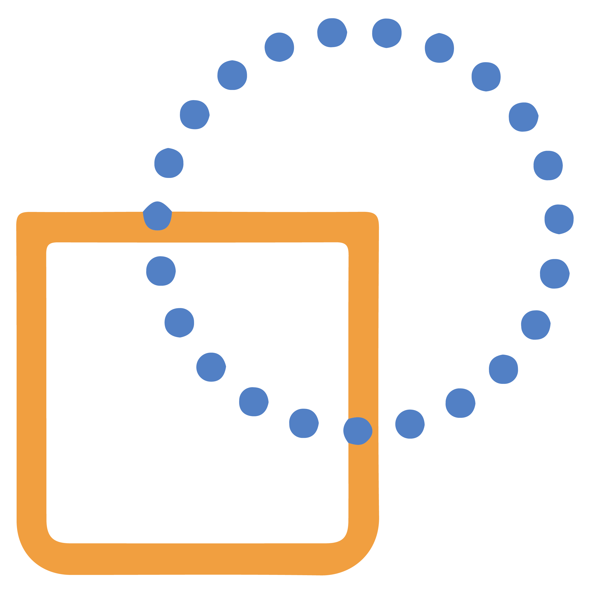</a></td>
			<td></td>
			<td><a href="../projects/angel/stacked/color/angel-stacked-color.svg" download>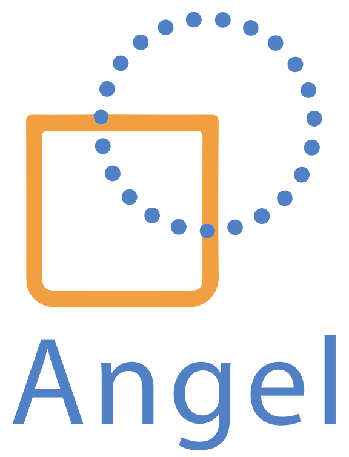</a></td>
			<td></td>
		</tr>
		<tr>
			<th>white</th>
			<td></td>
			<td></td>
			<td></td>
			<td></td>
			<td><a href="../projects/angel/stacked/white/angel-stacked-white.svg" download>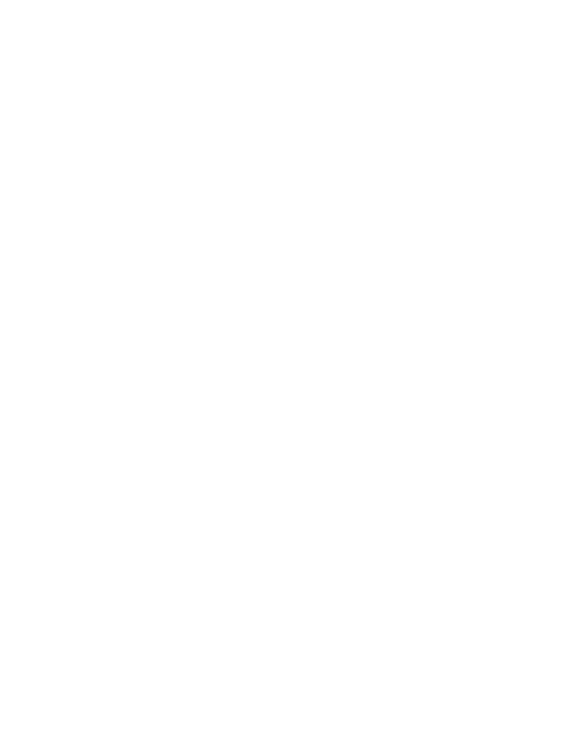</a></td>
			<td><a href="../projects/angel/icon/white/angel-icon-white.svg" download>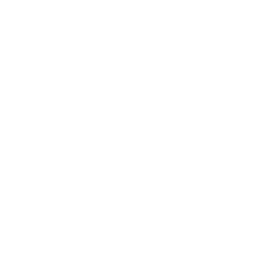</a></td>
		</tr>
		<tr>
			<th>black</th>
			<td></td>
			<td></td>
			<td><a href="../projects/angel/icon/black/angel-icon-black.png" download>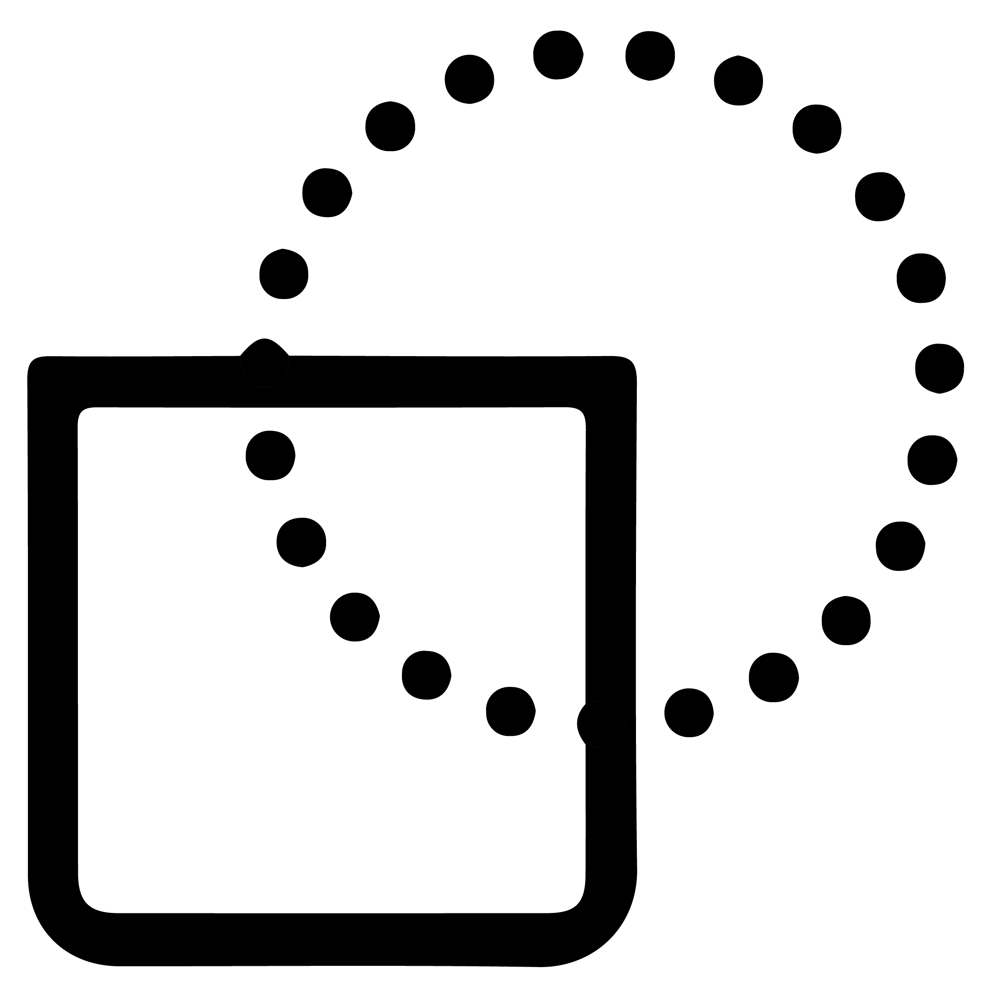</a></td>
			<td></td>
			<td></td>
			<td></td>
		</tr>
	</tbody>	
</table>

### Delta

<table class="logos-table">
	<thead>
		<tr>
			<th></th>
			<th colspan="3">PNG</th>
			<th colspan="3">SVG</th>
		</tr>
		<tr>
			<th></th>
			<th>horizontal</th>
			<th>stacked</th>
			<th>icon</th>
			<th>horizontal</th>
			<th>stacked</th>
			<th>icon</th>
		</tr>
	</thead>	
    <tbody>
		<tr>
			<th>color</th>
			<td><a href="../projects/delta/horizontal/color/delta-horizontal-color.png" download>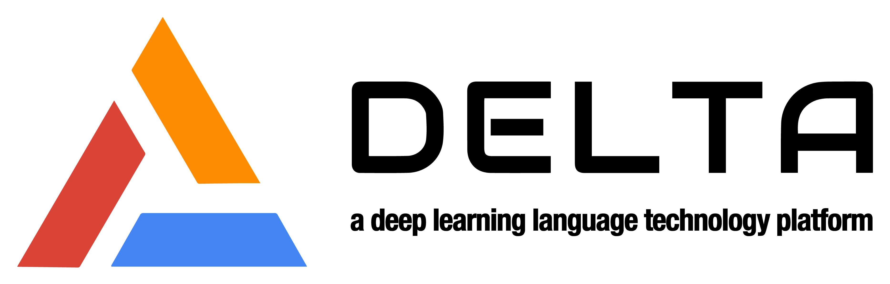</a></td>
			<td></td>
			<td><a href="../projects/delta/icon/color/delta-icon-color.png" download>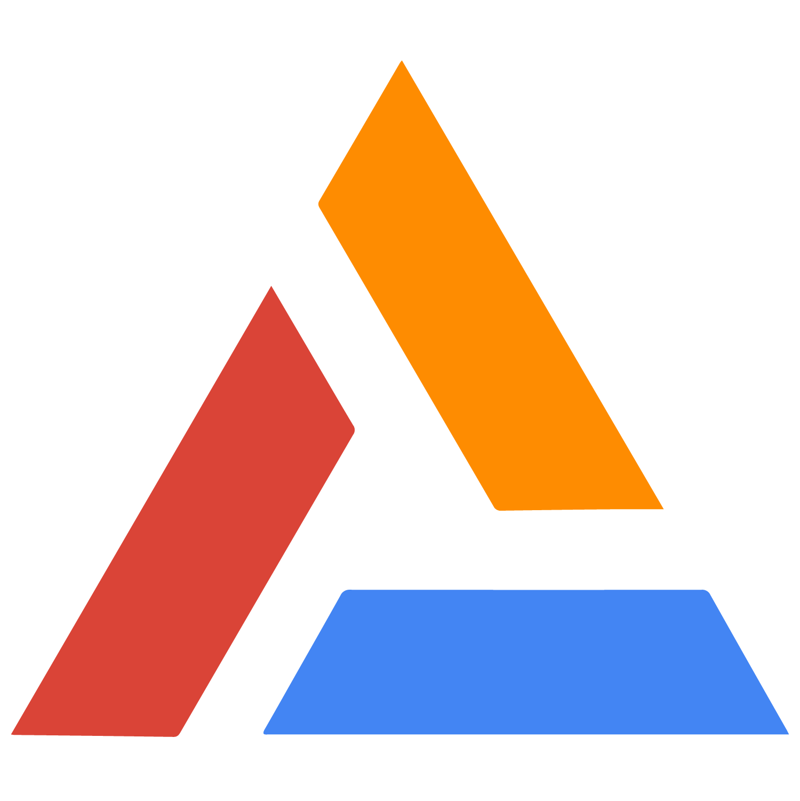</a></td>
			<td></td>
			<td><a href="../projects/delta/stacked/color/delta-stacked-color.svg" download>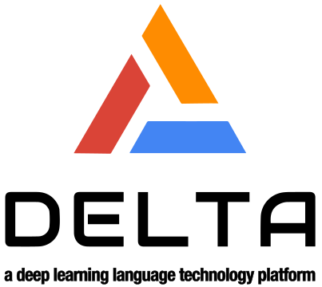</a></td>
			<td></td>
		</tr>
		<tr>
			<th>white</th>
			<td></td>
			<td></td>
			<td></td>
			<td></td>
			<td></td>
			<td></td>
		</tr>
		<tr>
			<th>black</th>
			<td></td>
			<td></td>
			<td><a href="../projects/delta/icon/black/delta-icon-black.png" download>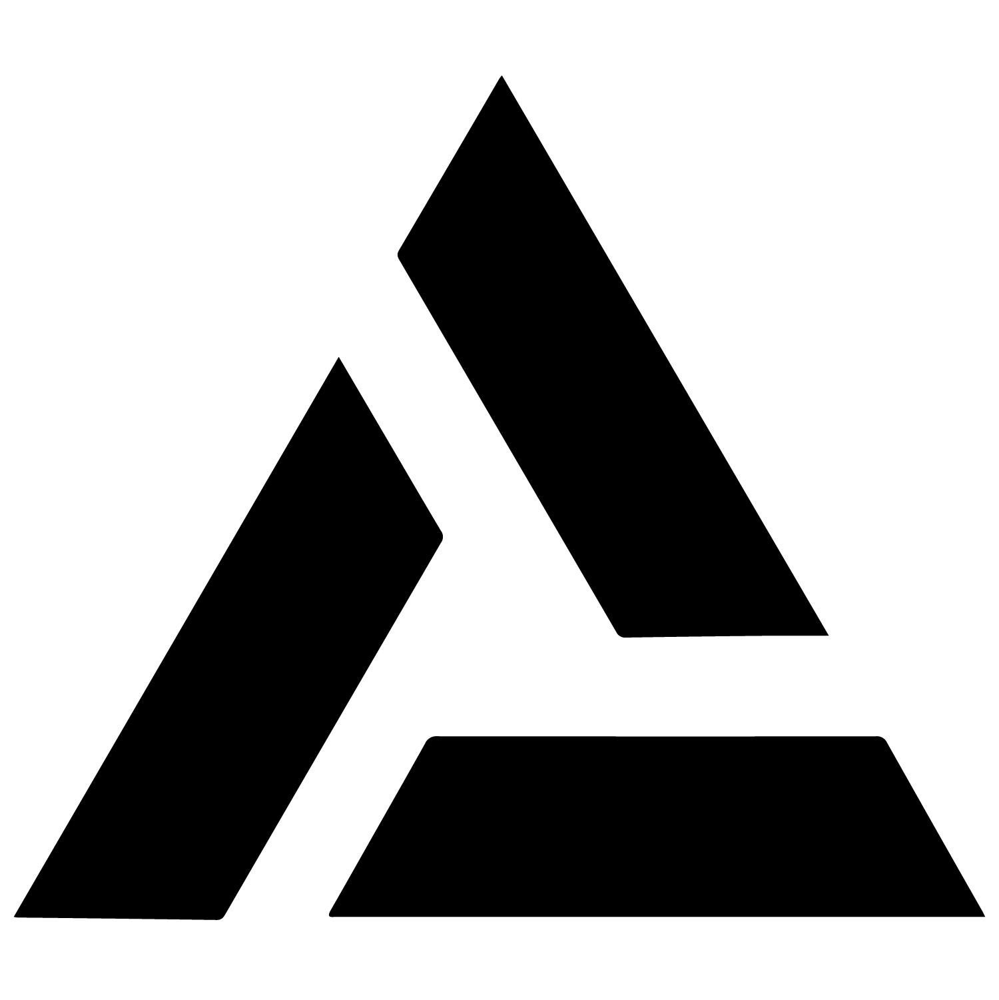</a></td>
			<td></td>
			<td></td>
			<td></td>
		</tr>
	</tbody>	
</table>

### Elastic Deep Learning

<table class="logos-table">
	<thead>
		<tr>
			<th></th>
			<th colspan="3">PNG</th>
			<th colspan="3">SVG</th>
		</tr>
		<tr>
			<th></th>
			<th>horizontal</th>
			<th>stacked</th>
			<th>icon</th>
			<th>horizontal</th>
			<th>stacked</th>
			<th>icon</th>
		</tr>
	</thead>	
    <tbody>
		<tr>
			<th>color</th>
			<td></td>
			<td><a href="../projects/edl/stacked/color/edl-stacked-color.png" download>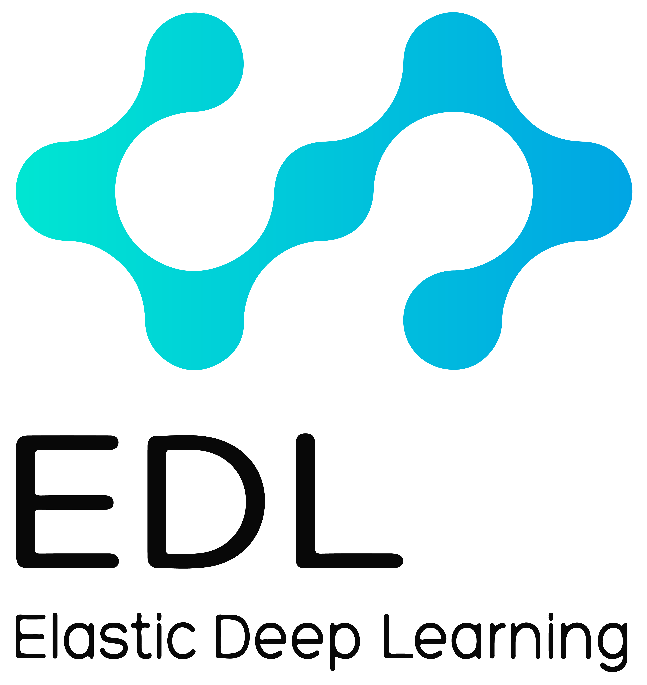</a></td>
			<td><a href="../projects/edl/icon/color/edl-icon-color.png" download>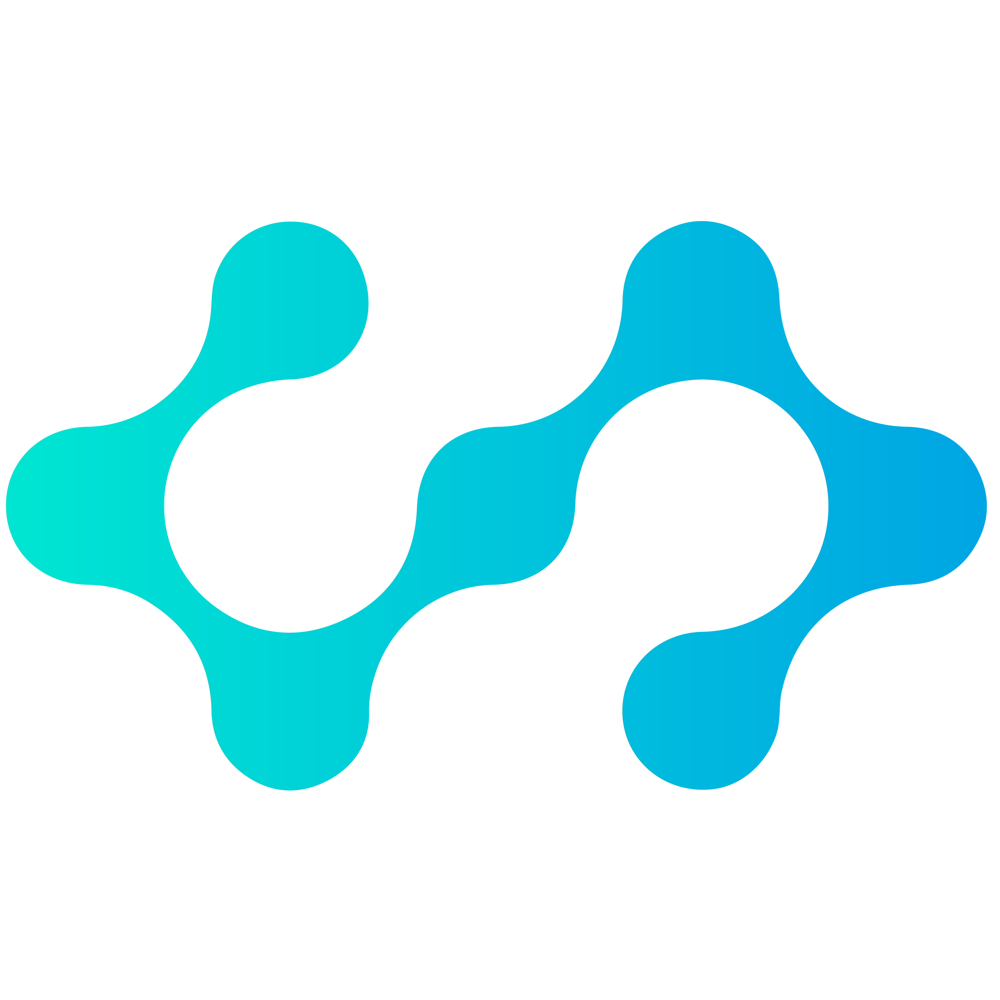</a></td>
			<td></td>
			<td></td>
			<td></td>
		</tr>
		<tr>
			<th>white</th>
			<td></td>
			<td></td>
			<td></td>
			<td></td>
			<td></td>
			<td><a href="../projects/edl/icon/white/edl-icon-white.svg" download>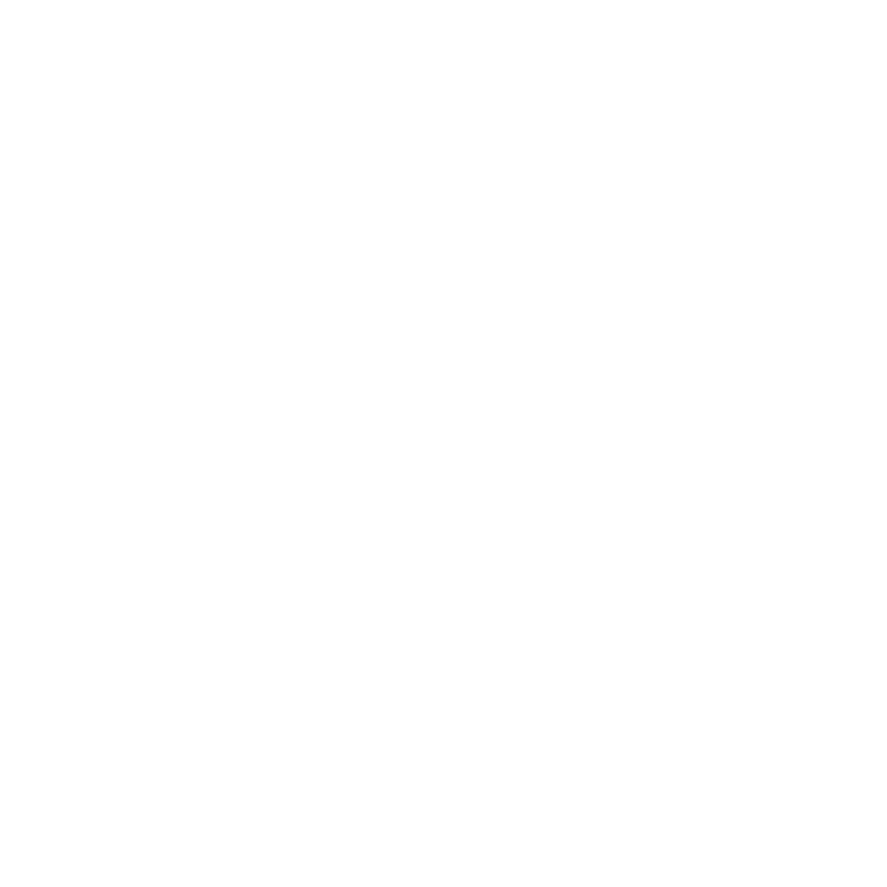</a></td>
		</tr>
		<tr>
			<th>black</th>
			<td></td>
			<td></td>
			<td><a href="../projects/edl/icon/black/edl-icon-black.png" download>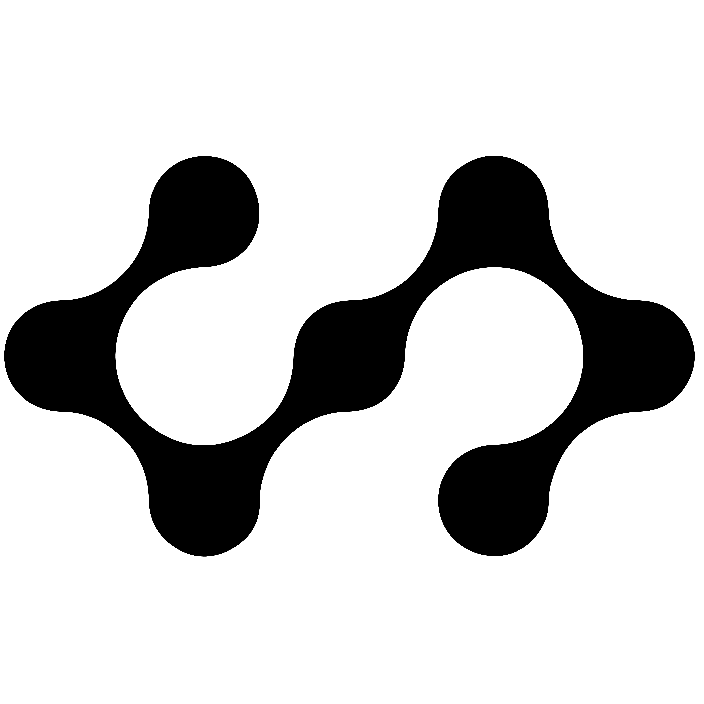</a></td>
			<td></td>
			<td></td>
			<td></td>
		</tr>
	</tbody>	
</table>

### Egeria

<table class="logos-table">
	<thead>
		<tr>
			<th></th>
			<th colspan="2">PNG</th>
			<th colspan="2">SVG</th>
		</tr>
		<tr>
			<th></th>
			<th>horizontal</th>
			<th>icon</th>
			<th>horizontal</th>
			<th>icon</th>
		</tr>
	</thead>	
    <tbody>
		<tr>
			<th>color</th>
			<td></td>
			<td></td>
			<td></td>
			<td></td>
		</tr>
		<tr>
			<th>white</th>
			<td></td>
			<td></td>
			<td></td>
			<td></td>
		</tr>
		<tr>
			<th>black</th>
			<td></td>
			<td></td>
			<td></td>
			<td></td>
		</tr>
	</tbody>	
</table>

### Feast

<table class="logos-table">
	<thead>
		<tr>
			<th></th>
			<th colspan="3">PNG</th>
			<th colspan="3">SVG</th>
		</tr>
		<tr>
			<th></th>
			<th>horizontal</th>
			<th>stacked</th>
			<th>icon</th>
			<th>horizontal</th>
			<th>stacked</th>
			<th>icon</th>
		</tr>
	</thead>	
    <tbody>
		<tr>
			<th>color</th>
			<td></td>
			<td></td>
			<td></td>
			<td></td>
			<td></td>
			<td></td>
		</tr>
		<tr>
			<th>white</th>
			<td></td>
			<td></td>
			<td></td>
			<td><a href="../projects/feast/horizontal/white/feast-horizontal-white.svg" download>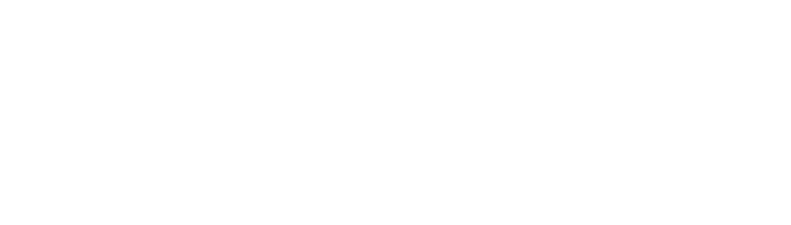</a></td>
			<td></td>
			<td></td>
		</tr>
		<tr>
			<th>black</th>
			<td><a href="../projects/feast/horizontal/black/feast-horizontal-black.png" download>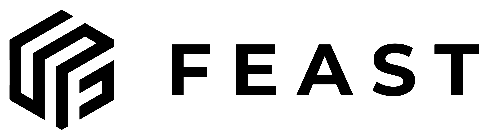</a></td>
			<td><a href="../projects/feast/stacked/black/feast-stacked-black.png" download>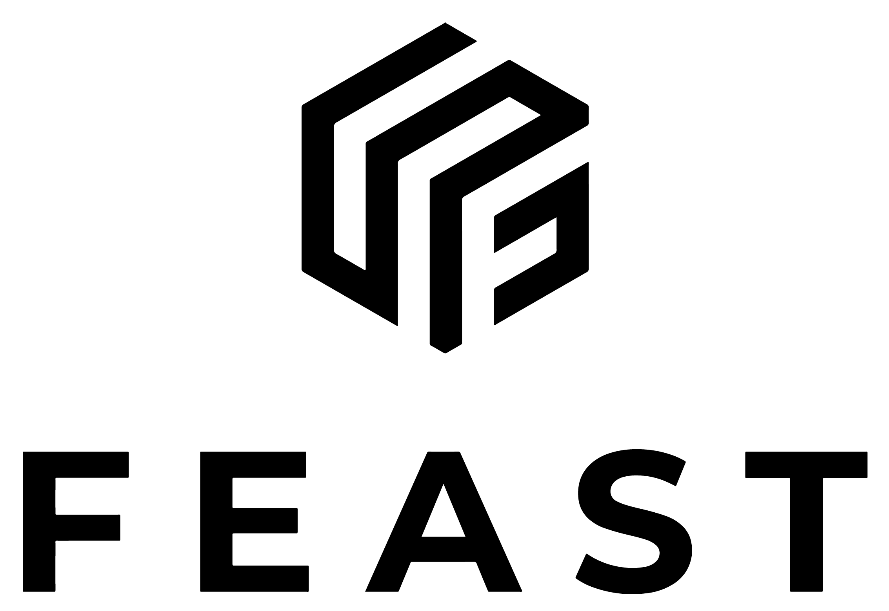</a></td>
			<td></td>
			<td></td>
			<td></td>
			<td></td>
		</tr>
	</tbody>	
</table>

### ForestFlow

<table class="logos-table">
	<thead>
		<tr>
			<th></th>
			<th colspan="3">PNG</th>
			<th colspan="3">SVG</th>
		</tr>
		<tr>
			<th></th>
			<th>horizontal</th>
			<th>stacked</th>
			<th>icon</th>
			<th>horizontal</th>
			<th>stacked</th>
			<th>icon</th>
		</tr>
	</thead>	
    <tbody>
		<tr>
			<th>color</th>
			<td></td>
			<td></td>
			<td></td>
			<td></td>
			<td></td>
			<td></td>
		</tr>
		<tr>
			<th>white</th>
			<td></td>
			<td></td>
			<td></td>
			<td></td>
			<td></td>
			<td></td>
		</tr>
		<tr>
			<th>black</th>
			<td></td>
			<td></td>
			<td></td>
			<td></td>
			<td></td>
			<td></td>
		</tr>
	</tbody>	
</table>

### Horovod

<table class="logos-table">
	<thead>
		<tr>
			<th></th>
			<th colspan="3">PNG</th>
			<th colspan="3">SVG</th>
		</tr>
		<tr>
			<th></th>
			<th>horizontal</th>
			<th>stacked</th>
			<th>icon</th>
			<th>horizontal</th>
			<th>stacked</th>
			<th>icon</th>
		</tr>
	</thead>	
    <tbody>
		<tr>
			<th>color</th>
			<td></td>
			<td></td>
			<td></td>
			<td></td>
			<td></td>
			<td></td>
		</tr>
		<tr>
			<th>white</th>
			<td></td>
			<td></td>
			<td></td>
			<td></td>
			<td></td>
			<td><a href="../projects/horovod/icon/white/horovod-icon-white.svg" download>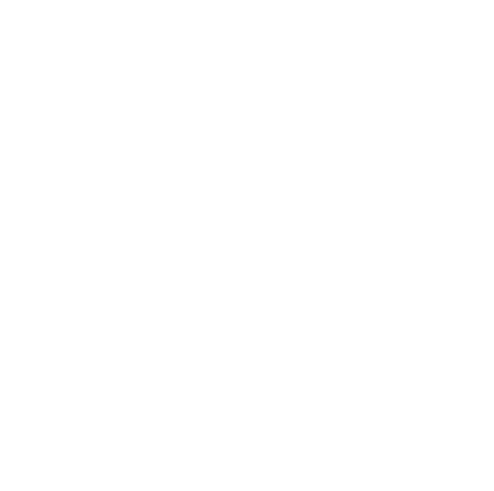</a></td>
		</tr>
		<tr>
			<th>black</th>
			<td><a href="../projects/horovod/horizontal/black/horovod-horizontal-black.png" download>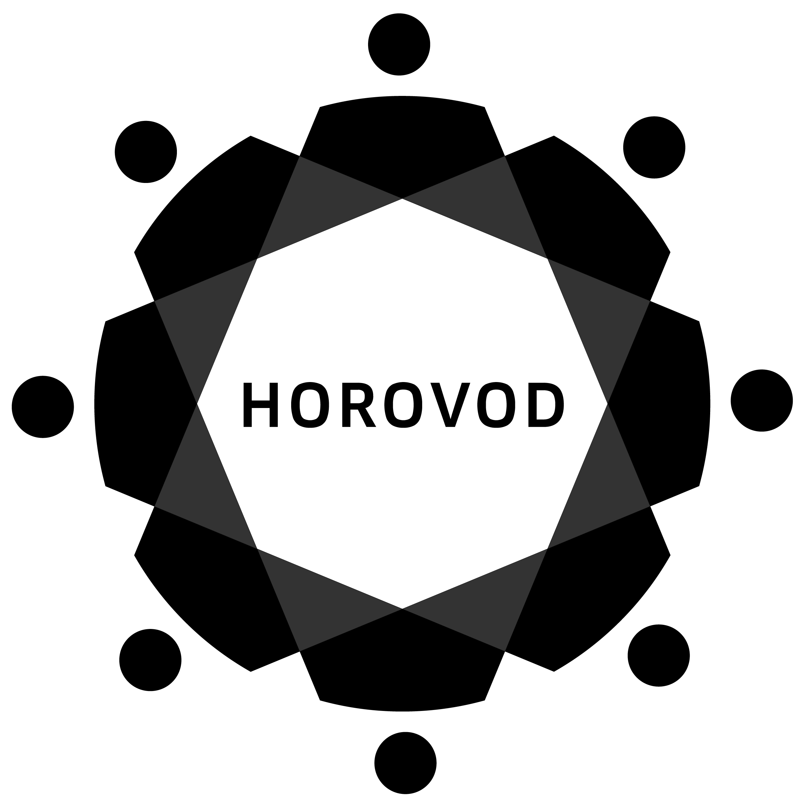</a></td>
			<td></td>
			<td></td>
			<td></td>
			<td></td>
			<td></td>
		</tr>
	</tbody>	
</table>

### Ludwig

<table class="logos-table">
	<thead>
		<tr>
			<th></th>
			<th colspan="3">PNG</th>
			<th colspan="3">SVG</th>
		</tr>
		<tr>
			<th></th>
			<th>horizontal</th>
			<th>icon</th>
			<th>horizontal</th>
			<th>icon</th>
		</tr>
	</thead>	
    <tbody>
		<tr>
			<th>empty</th>
			<td></td>
			<td></td>
			<td></td>
			<td></td>
		</tr>
		<tr>
			<th>empty-neg</th>
			<td><a href="../projects/ludwig/horizontal/ludwig-horizontal-empty-neg.png" download>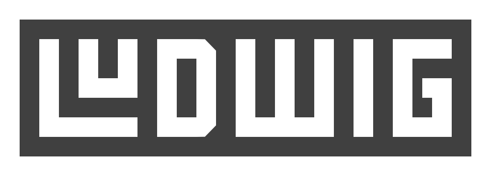</a></td>
			<td></td>
			<td></td>
			<td></td>
		</tr>
		<tr>
			<th>full</th>
			<td></td>
			<td></td>
			<td></td>
			<td></td>
		</tr>
		<tr>
			<th>full-neg</th>
			<td></td>
			<td></td>
			<td></td>
			<td></td>
		</tr>
	</tbody>	
</table>

### Marquez

<table class="logos-table">
	<thead>
		<tr>
			<th></th>
			<th colspan="3">PNG</th>
			<th colspan="3">SVG</th>
		</tr>
		<tr>
			<th></th>
			<th>horizontal</th>
			<th>stacked</th>
			<th>icon</th>
			<th>horizontal</th>
			<th>stacked</th>
			<th>icon</th>
		</tr>
	</thead>	
    <tbody>
		<tr>
			<th>color</th>
			<td></td>
			<td></td>
			<td></td>
			<td></td>
			<td></td>
			<td></td>
		</tr>
		<tr>
			<th>color - reverse</th>
			<td></td>
			<td></td>
			<td></td>
			<td></td>
			<td></td>
			<td></td>
		</tr>
		<tr>
			<th>white - solid</th>
			<td></td>
			<td></td>
			<td></td>
			<td></td>
			<td></td>
			<td></td>
		</tr>
		<tr>
		<th>white - transparent</th>
			<td></td>
			<td></td>
			<td></td>
			<td></td>
			<td></td>
			<td></td>
		</tr>
		<tr>
			<th>black - solid</th>
			<td></td>
			<td></td>
			<td></td>
			<td></td>
			<td></td>
			<td></td>
		</tr>
		<tr>
		<th>black - transparent</th>
			<td></td>
			<td></td>
			<td></td>
			<td></td>
			<td></td>
			<td></td>
		</tr>
	</tbody>	
</table>

### Milvus

<table class="logos-table">
	<thead>
		<tr>
			<th></th>
			<th colspan="3">PNG</th>
			<th colspan="3">SVG</th>
		</tr>
		<tr>
			<th></th>
			<th>horizontal</th>
			<th>stacked</th>
			<th>icon</th>
			<th>horizontal</th>
			<th>stacked</th>
			<th>icon</th>
		</tr>
	</thead>	
    <tbody>
		<tr>
			<th>color</th>
			<td></td>
			<td></td>
			<td></td>
			<td></td>
			<td></td>
			<td></td>
		</tr>
		<tr>
			<th>white</th>
			<td></td>
			<td></td>
			<td></td>
			<td></td>
			<td></td>
			<td></td>
		</tr>
		<tr>
			<th>black</th>
			<td><a href="../projects/milvus/horizontal/black/milvus-horizontal-black.png" download>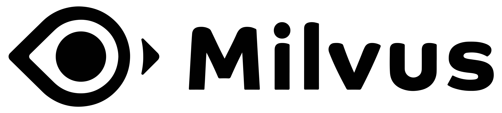</a></td>
			<td></td>
			<td></td>
			<td></td>
			<td></td>
			<td></td>
		</tr>
	</tbody>	
</table>

### NNStreamer

<table class="logos-table">
	<thead>
		<tr>
			<th></th>
			<th colspan="3">PNG</th>
			<th colspan="3">SVG</th>
		</tr>
		<tr>
			<th></th>
			<th>horizontal</th>
			<th>stacked</th>
			<th>icon</th>
			<th>horizontal</th>
			<th>stacked</th>
			<th>icon</th>
		</tr>
	</thead>	
    <tbody>
		<tr>
			<th>color</th>
			<td></td>
			<td><a href="../projects/nnstreamer/stacked/color/nnstreamer-stacked-color.png" download>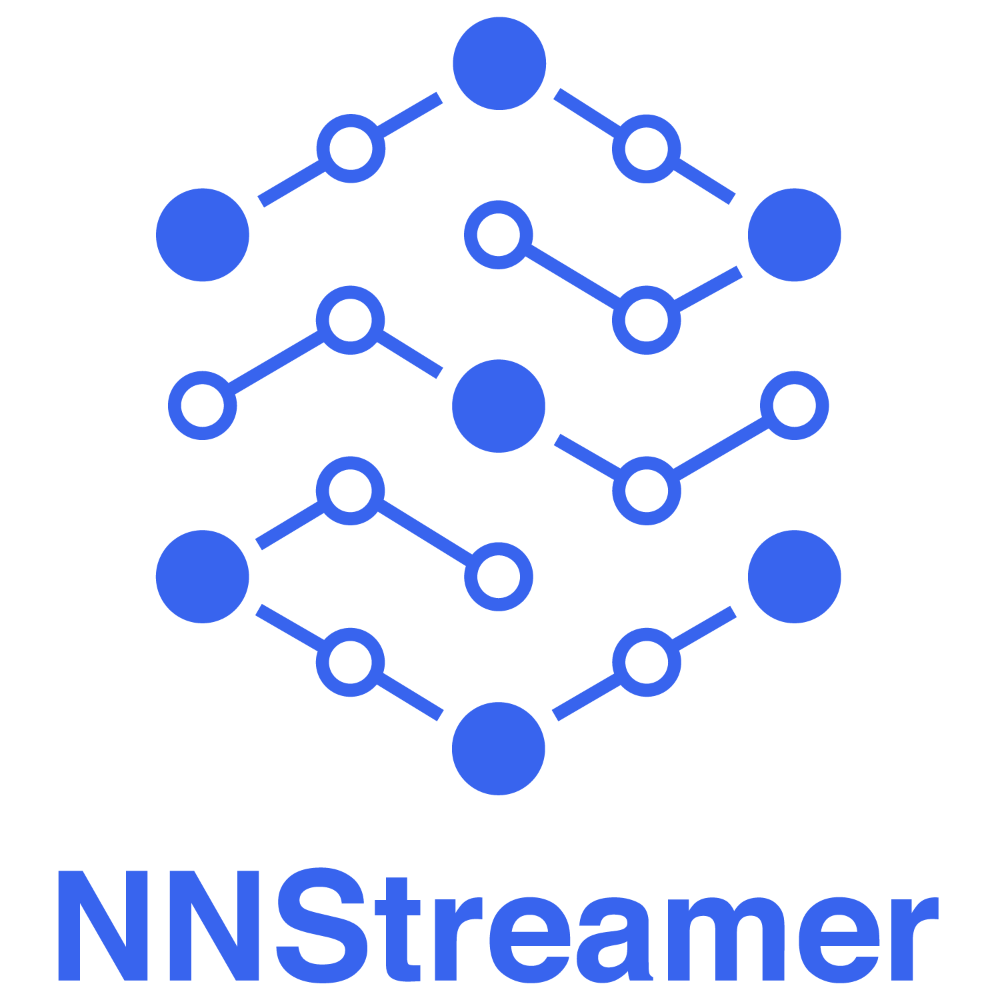</a></td>
			<td></td>
			<td></td>
			<td></td>
			<td></td>
		</tr>
		<tr>
			<th>white</th>
			<td></td>
			<td></td>
			<td></td>
			<td></td>
			<td><a href="../projects/nnstreamer/stacked/white/nnstreamer-stacked-white.svg" download>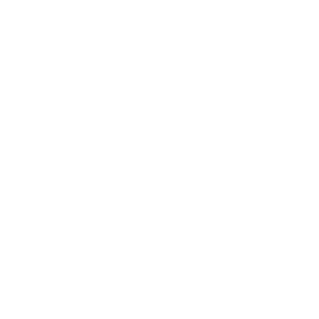</a></td>
			<td><a href="../projects/nnstreamer/icon/white/nnstreamer-icon-white.svg" download>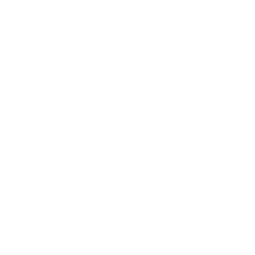</a></td>
		</tr>
		<tr>
			<th>black</th>
			<td></td>
			<td></td>
			<td></td>
			<td></td>
			<td></td>
			<td></td>
		</tr>
	</tbody>	
</table>

### ONNX

<table class="logos-table">
	<thead>
		<tr>
			<th></th>
			<th colspan="3">PNG</th>
			<th colspan="3">SVG</th>
		</tr>
		<tr>
			<th></th>
			<th>horizontal</th>
			<th>stacked</th>
			<th>icon</th>
			<th>horizontal</th>
			<th>stacked</th>
			<th>icon</th>
		</tr>
	</thead>	
    <tbody>
		<tr>
			<th>color</th>
			<td></td>
			<td></td>
			<td></td>
			<td></td>
			<td></td>
			<td></td>
		</tr>
		<tr>
			<th>white</th>
			<td></td>
			<td></td>
			<td></td>
			<td></td>
			<td><a href="../projects/onnx/stacked/white/onnx-stacked-white.svg" download>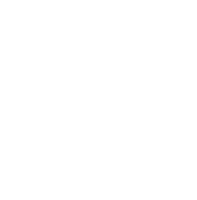</a></td>
			<td><a href="../projects/onnx/icon/white/onnx-icon-white.svg" download>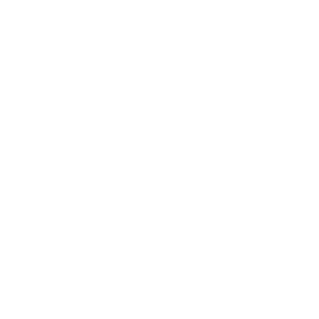</a></td>
		</tr>
		<tr>
			<th>black</th>
			<td></td>
			<td></td>
			<td><a href="../projects/onnx/icon/black/onnx-icon-black.png" download>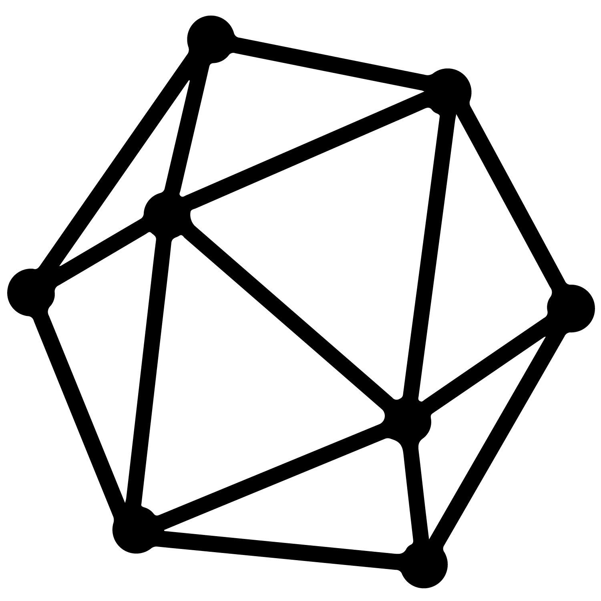</a></td>
			<td></td>
			<td></td>
			<td></td>
		</tr>
	</tbody>	
</table>

### OpenDS4All

<table class="logos-table">
	<thead>
		<tr>
			<th></th>
			<th colspan="3">PNG</th>
			<th colspan="3">SVG</th>
		</tr>
		<tr>
			<th></th>
			<th>horizontal</th>
			<th>icon</th>
			<th>horizontal</th>
			<th>icon</th>
		</tr>
	</thead>	
    <tbody>
		<tr>
			<th>color</th>
			<td></td>
			<td></td>
			<td></td>
			<td></td>
		</tr>
		<tr>
			<th>white</th>
			<td></td>
			<td></td>
			<td></td>
			<td></td>
		</tr>
		<tr>
			<th>black</th>
			<td></td>
			<td></td>
			<td></td>
			<td></td>
		</tr>
	</tbody>	
</table>

### Pyro

<table class="logos-table">
	<thead>
		<tr>
			<th></th>
			<th colspan="3">PNG</th>
			<th colspan="3">SVG</th>
		</tr>
		<tr>
			<th></th>
			<th>horizontal</th>
			<th>stacked</th>
			<th>icon</th>
			<th>horizontal</th>
			<th>stacked</th>
			<th>icon</th>
		</tr>
	</thead>	
    <tbody>
		<tr>
			<th>color</th>
			<td></td>
			<td></td>
			<td></td>
			<td></td>
			<td></td>
			<td></td>
		</tr>
		<tr>
			<th>white</th>
			<td></td>
			<td></td>
			<td></td>
			<td></td>
			<td></td>
			<td></td>
		</tr>
		<tr>
			<th>black</th>
			<td></td>
			<td></td>
			<td></td>
			<td></td>
			<td></td>
			<td></td>
		</tr>
	</tbody>	
</table>

### soajs

<table class="logos-table">
	<thead>
		<tr>
			<th></th>
			<th colspan="3">PNG</th>
			<th colspan="3">SVG</th>
		</tr>
		<tr>
			<th></th>
			<th>horizontal</th>
			<th>stacked</th>
			<th>icon</th>
			<th>horizontal</th>
			<th>stacked</th>
			<th>icon</th>
		</tr>
	</thead>	
    <tbody>
		<tr>
			<th>color</th>
			<td></td>
			<td></td>
			<td></td>
			<td></td>
			<td></td>
			<td></td>
		</tr>
		<tr>
			<th>white</th>
			<td></td>
			<td></td>
			<td></td>
			<td></td>
			<td></td>
			<td></td>
		</tr>
		<tr>
			<th>black</th>
			<td><a href="../projects/soajs/horizontal/black/soajs-horizontal-black.png" download>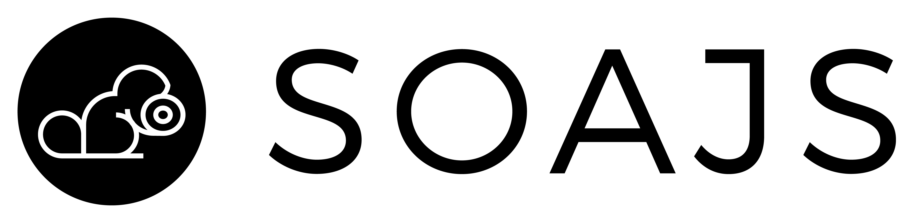</a></td>
			<td></td>
			<td></td>
			<td></td>
			<td></td>
			<td></td>
		</tr>
	</tbody>	
</table>

### Sparklyr

<table class="logos-table">
	<thead>
		<tr>
			<th></th>
			<th>PNG</th>
			<th>SVG</th>
		</tr>
	</thead>	
    <tbody>
		<tr>
			<th>color</th>
			<td></td>
			<td></td>
		</tr>
		<tr>
			<th>white</th>
			<td></td>
			<td></td>
		</tr>
		<tr>
			<th>black</th>
			<td></td>
			<td></td>
		</tr>
	</tbody>	
</table>

