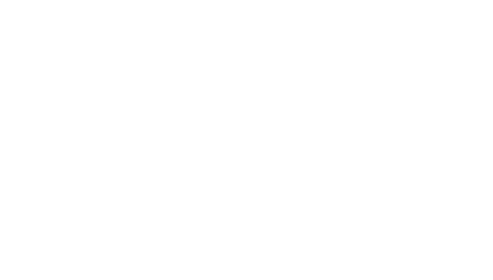

## AI Explainability 360

*Note: GitHub Flavored Markdown used in the Readme doesn't support background colors. The white logos below are displayed on the light grey of tables.*

<table class="logos-table">
	<thead>
		<tr>
			<th></th>
			<th colspan="3">PNG</th>
			<th colspan="3">SVG</th>
		</tr>
		<tr>
			<th></th>
			<th>horizontal</th>
			<th>stacked</th>
			<th>icon</th>
			<th>horizontal</th>
			<th>stacked</th>
			<th>icon</th>
		</tr>
	</thead>	
    <tbody>
		<tr>
			<th>color</th>
			<td></td>
			<td></td>
			<td></td>
			<td></td>
			<td></td>
			<td></td>
		</tr>
		<tr>
			<th>white</th>
			<td></td>
			<td></td>
			<td></td>
			<td></td>
			<td></td>
			<td></td>
		</tr>
		<tr>
			<th>black</th>
			<td></td>
			<td></td>
			<td></td>
			<td></td>
			<td></td>
			<td></td>
		</tr>
	</tbody>	
</table>

``
